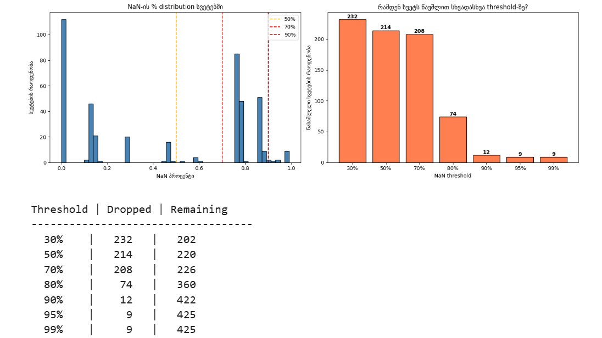
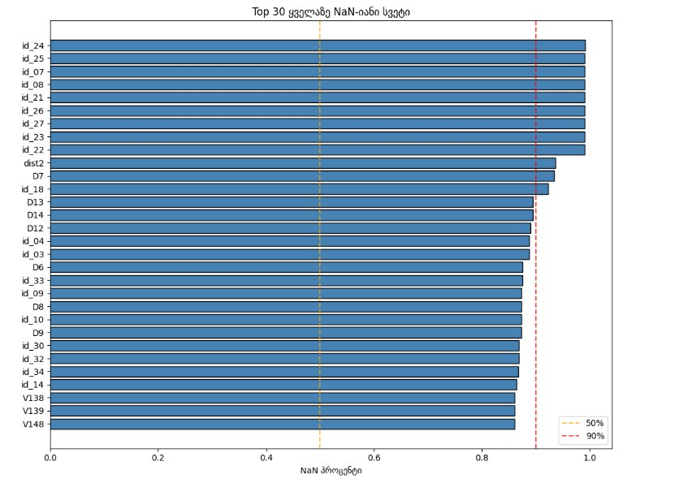
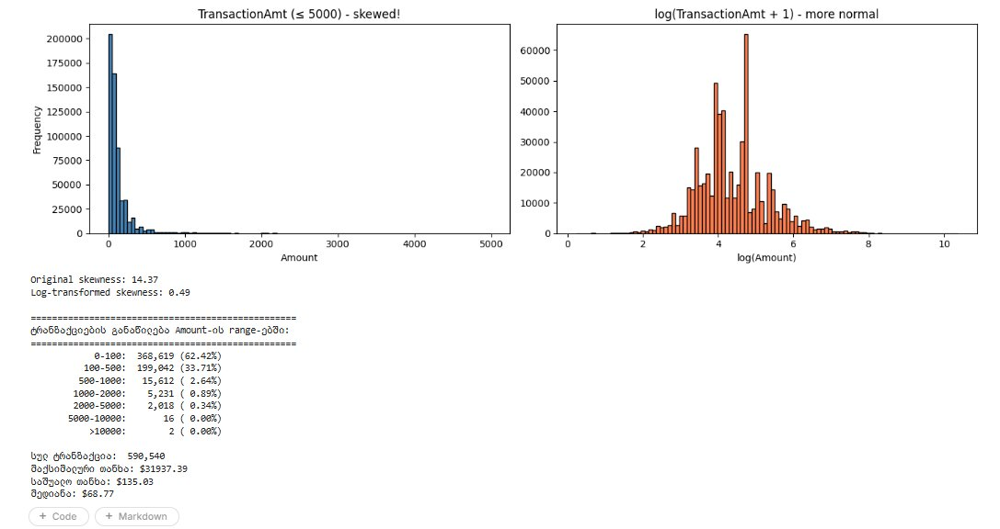
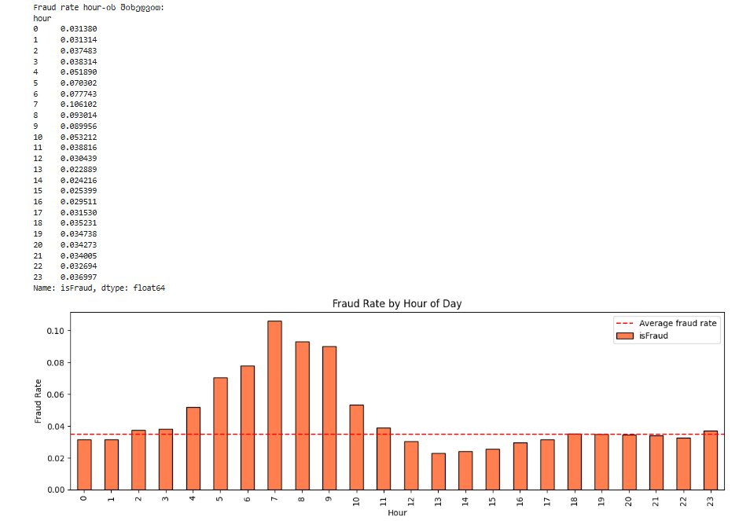
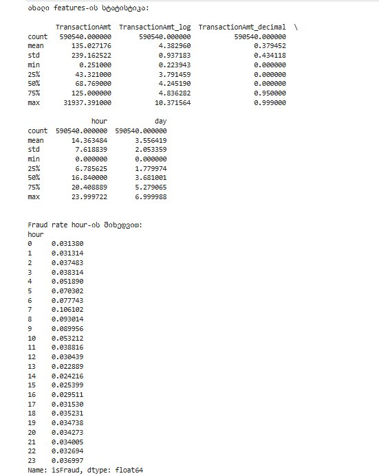
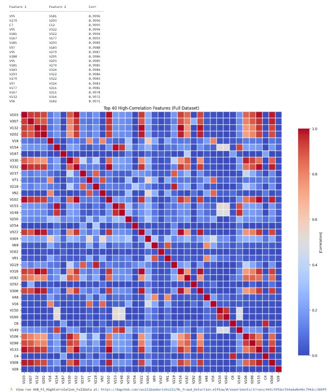
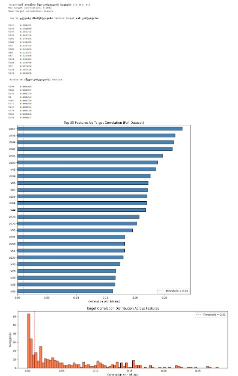
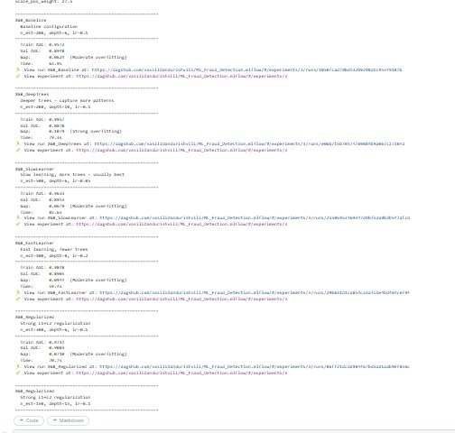
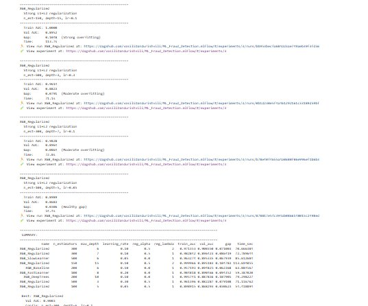
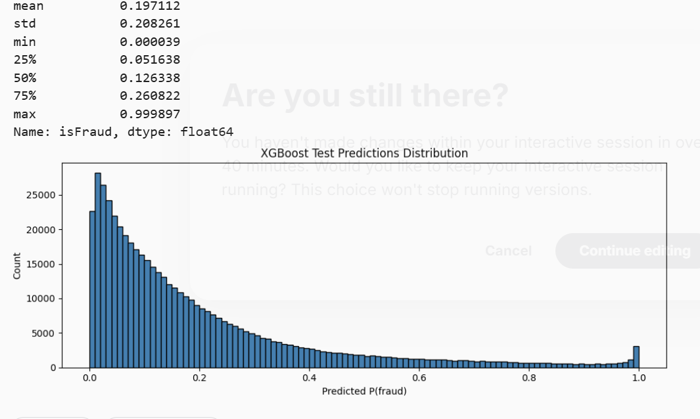

# IEEE-CIS Fraud Detection

## Kaggle-ის კონკურსის მიმოხილვა

ამ პროექტში გადავწყვიტეთ Kaggle-ის [IEEE-CIS Fraud Detection](https://www.kaggle.com/competitions/ieee-fraud-detection) კონკურსის ამოცანა — მონაცემებიდან ტრანზაქციების მახასიათებლების გამოყენებით უნდა შეფასდეს, არის თუ არა ცალკეული ტრანზაქცია თაღლითური (`isFraud = 1`) თუ არა (`isFraud = 0`).

დატა შედგება ორი ფაილისგან:
- `train_transaction.csv` — 590,540 ტრანზაქცია, 394 სვეტი
- `train_identity.csv` — 144,233 row, 41 სვეტი (იდენტობის ინფორმაცია, ხელმისაწვდომია მხოლოდ ტრანზაქციების ნაწილისთვის)

ამოცანის შეფასების მეტრიკაა **ROC AUC** Kaggle Leaderboard-ზე.

დატას ძირითადი გამოწვევები:
- მნიშვნელოვანი class imbalance (~3.5% fraud)
- ბევრი NaN მნიშვნელობა — ზოგ სვეტში 90%-ზე მეტი
- 339 ანონიმური `V` სვეტი ერთმანეთთან ძლიერი კორელაციით
- მაღალი cardinality categorical სვეტები (`card1` ~13,000 უნიკალური მნიშვნელობა)

## ჩემი მიდგომა

დავალების გადასაჭრელად სამი მოდელის არქიტექტურა გამოვცადე — Logistic Regression, Random Forest და XGBoost — თითოეული ცალცალკე notebook-ში. სამივე notebook-ში გავიარე ერთიანი workflow:

1. **Cleaning** — მაღალი NaN პროცენტის სვეტების მოშორება
2. **Feature Engineering** — ახალი features-ების შექმნა (log transform, time-based features, email domain გამარტივება)
3. **Feature Selection** — სამი მიდგომის კომბინაცია (Low Variance, High Correlation, Target Correlation)
4. **Training** — Pipeline-ის შენება, hyperparameter-ების ცდა, საუკეთესო კონფიგურაციის შერჩევა
5. **MLflow Tracking** — ყველა ეტაპი DagsHub-ზე ცალცალკე run-ად ჩაიწერა

ყოველი მოდელის Pipeline დარეგისტრირდა MLflow Model Registry-ში, საიდანაც ცალკე `model_inference.ipynb` notebook ატვირთავს საუკეთესოს და ახდენს test set-ზე prediction-ს.

## რეპოზიტორიის სტრუქტურა

```
ML_Fraud_Detection/
├── README.md                                       # ეს ფაილი
├── model_experiment_LogisticRegression.ipynb       # Logistic Regression
├── model_experiment_RandomForest.ipynb             # Random Forest
├── model_experiment_XGBoost.ipynb                  # XGBoost (საუკეთესო მოდელი)
└── model_inference.ipynb                           # Inference saved Pipeline-ით
```

თითოეული `model_experiment_*.ipynb` notebook სრულად დამოუკიდებელია — შეიცავს Cleaning, Feature Engineering, Feature Selection და Training სექციებს. `model_inference.ipynb` ატვირთავს XGBoost Pipeline-ს Model Registry-დან და აგენერირებს Kaggle submission-ს.

## Cleaning

Cleaning ეტაპზე ვცადე NaN-იანი სვეტების მოშორება სხვადასხვა threshold-ით. ჯერ გავაანალიზე NaN-ების განაწილება:



ცხრილი აჩვენებს რა მოხდებოდა სხვადასხვა threshold-ისას:

| Threshold | წაიშლება | დარჩება |
|-----------|----------|---------|
| 30% | 232 | 202 |
| 50% | 214 | 220 |
| 70% | 208 | 226 |
| 80% | 74 | 360 |
| 90% | 12 | 422 |
| 95% | 9 | 425 |
| 99% | 9 | 425 |

ცხრილიდან ჩანს, რომ NaN-ების განაწილება bimodal-ია — სვეტებს ან ცოტა აქვს NaN (0-30%), ან ბევრი (75%+). შუა რეგიონი ცარიელია, რაც ნიშნავს რომ threshold-ის არჩევა მკვეთრად ცვლის შედეგს მხოლოდ 30%-დან 80%-მდე რეგიონში.

ასევე გავხედე Top 30 ყველაზე NaN-იან სვეტს:



ჩანს რომ `id_*` სვეტები ყველა ~99% NaN-ია, რადგან `train_identity.csv` მხოლოდ 25% ტრანზაქციისთვის არსებობდა. მათი მოშორება ლოგიკურია.

**არჩევანი:** Logistic Regression-ისთვის გამოვიყენე **0.75 threshold** (ბალანსი feature count-სა და მონაცემების ხარისხს შორის). Random Forest-სა და XGBoost-ისთვის ასევე იგივე ლოგიკით 0.5 და 0.9 შესაბამისად threshold-ი დავტოვე, რადგან tree-based მოდელები კარგად უმკლავდებიან NaN-იან feature-ებს(RF-ზა 0.5-ზე კაი შედეგი აჩვენა და დავტოვე, ხოლო xgboost კარგად უმკლავდება nan-ებს და 0.9-ზე ავწიე), მაგრამ უსარგებლო სვეტების შენარჩუნება მხოლოდ training-ის სიჩქარეს ამცირებს.

## Feature Engineering

ხუთი ახალი feature შევქმენი:

### 1. TransactionAmt_log

`TransactionAmt` ძალიან skewed-ია — ბევრი პატარა ტრანზაქციაა და ცოტა უზარმაზარი. log transform გადაიყვანს უფრო ნორმალურ distribution-ად:



ცხრილიდან ჩანს რომ:
- Original skewness: **14.37** (ძალიან skewed)
- Log-transformed skewness: **0.49** (კარგი distribution)

ასევე ნათლად ჩანს რომ ~96% ტრანზაქცია 500-ზე ნაკლებია, ხოლო maximum $31,937.39-ია — ეს outlier-ები წრფივი მოდელების coefficient-ებს ანახვევენ. log transform-ი ამ პრობლემას აგვარებს.

### 2. TransactionAmt_decimal

თანხის decimal ნაწილი (მაგ., $123.47-ისთვის → 0.47). ლოგიკა: fraud ხშირად "მრგვალი" თანხებით ხდება ($100.00, $500.00), მაშინ როცა რეალური მომხმარებლები ხშირად ხარჯავენ "ლუწ" თანხებს ($23.47).

### 3 & 4. hour და day

`TransactionDT` სვეტი წამებშია reference moment-დან — მოდელისთვის უაზრო რიცხვი. გადავიყვანე საათისა და კვირის დღის feature-ებად:

```python
df['hour'] = (df['TransactionDT'] / 3600) % 24
df['day'] = (df['TransactionDT'] / (3600 * 24)) % 7
```

`hour` feature-ის სიგნალი ძალიან ნათელია — fraud rate-ი საათის მიხედვით:



ცხრილიდან ჩანს რომ ღამის საათებში (5-9 საათი) fraud rate ~10%-ია — დაახლოებით 3x საშუალოზე მაღალი. დღის საათებში (12-16) fraud rate ~2.5%-ია — საშუალოზე დაბალი. ეს ლოგიკურია: რეალური მომხმარებლები სძინავთ ღამით, ხოლო თაღლითები სწორედ ამ დროს მოქმედებენ.

### 5. P_emaildomain_bin / R_emaildomain_bin

email domain-ში ბევრი ვარიაცია გვაქვს — `gmail.com`, `gmail.co.uk`, `gmail.fr` ცალცალკე category-ები არიან, თუმცა არსებითად იგივეა. გავაერთიანე პირველი ნაწილით:

```python
df[col + '_bin'] = df[col].astype(str).str.split('.').str[0]
```

ეს ამცირებს cardinality-ს და მოდელს უფრო სტაბილურ სიგნალს აძლევს.

### Feature Engineering-ის შემდეგ სტატისტიკა



`hour` feature-ის mean ~14 (საშუალოდ შუადღე), max 23.99 — ნორმალური 0-24 დიაპაზონი. `TransactionAmt_log` mean 4.38, რაც e^4.38 ≈ $80 ტრანზაქციას შეესაბამება — ლოგიკურია.

## Feature Selection

სამი დამოუკიდებელი მიდგომა გამოვიყენე:

### 1. Low Variance

`VarianceThreshold(0.01)` — სვეტები სადაც variance < 0.01 თითქმის უცვლელ მნიშვნელობებს ნიშნავს. მოდელისთვის უსარგებლოა.

### 2. High Correlation

ვიპოვე feature-ების წყვილები რომელთა absolute correlation > 0.95. სრულ 590,540 row-ზე გავუშვი numpy-ის მეშვეობით (ბევრად სწრაფი vidre pandas):



შედეგი: heatmap-ში ნათლად ჩანს "კლასტერები" — ჯგუფი feature-ებისა, რომლებიც ერთმანეთთან 0.99+ კორელირებულია. ეს არის Vesta-ს engineered V-სვეტები, რომლებიც ერთიდაიგივე ინფორმაციას შეიცავენ.

Top წყვილები:
```
V95   ↔ V101  → 0.9996
V279  ↔ V293  → 0.9995
V97   ↔ V101  → 0.9994
V95   ↔ V322  → 0.9994
V101  ↔ V177  → 0.9993
```

ეს არის ცხადი multicollinearity — ერთი feature საკმარისია ყოველი წყვილისთვის. Logistic Regression-ი ამ პრობლემას ცუდად იტანს (coefficient-ები არასტაბილური ხდება).

### 3. Target Correlation

თითოეული feature-ის absolute correlation `isFraud`-თან. სვეტები რომლებსაც კორელაცია < 0.01 აქვთ, ცუდი feature-ებია წრფივი მოდელისთვის.



Top features by target correlation:
- `V257`: 0.2862
- `V246`: 0.2697
- `V244`: 0.2615
- `V242`: 0.2615

გასათვალისწინებელია — ეს მხოლოდ წრფივი კავშირია. Tree-based მოდელებს (RF, XGBoost) შეუძლიათ არაწრფივი patterns-ის აღმოჩენა, ამიტომ ამ filter-ს მათში უფრო ფრთხილად ვიყენებ.

### საბოლოო Selection

სამივე list-ი union-ით გავაერთიანე. შედეგი მოდელების მიხედვით:

| Model | Variance | Correlation | Target Corr | Final Features |
|-------|----------|-------------|-------------|----------------|
| Logistic Regression | 0.01 | 0.95 | 0.01 | 86 num + 20 cat = **106** |
| Random Forest | 0.01 | 0.95 | 0.01 | 81 num + 20 cat = **101** |
| XGBoost | 0.01 | 0.95 | 0.01 | 184 num + 20 cat = **204** |

XGBoost-ისთვის უფრო ბევრი feature დავტოვე — XGBoost native NaN handling იყენებს და მაღალ feature count-ს კარგად უმკლავდება.

## Training

თითოეული მოდელისთვის ავაშენე **sklearn Pipeline** რომელიც აერთიანებს preprocessing-სა და მოდელს ერთ ობიექტში. ეს კრიტიკულია — Pipeline test-ზე პირდაპირ მუშაობს preprocessing-ის ხელახლა გამოძახების გარეშე.

### Validation Strategy

ფანდი ხდება დროზე დამოკიდებული პრობლემაა — train data ადრეული პერიოდია, test კი ცოტა მოგვიანებითი. შესაბამისად, ჩვეულებრივი KFold split არ არის შესაფერისი (data leakage).

გამოვიყენე **Time-based 80/20 split**:
- Train: 472,432 row (ადრეული 80%)
- Validation: 118,108 row (გვიანი 20%)

ეს ემიტებს Kaggle-ის რეალურ test scenario-ს — მოდელი მხოლოდ წარსულიდან სწავლობს, შემდეგ მომავალზე ფასდება.

### Logistic Regression

**Pipeline:**
- Numerical: `SimpleImputer(median)` + `StandardScaler`
- Categorical: cardinality-ის მიხედვით სამ ჯგუფად:
  - Low (≤15 unique): One-Hot Encoding
  - Medium (16-100): Weight of Evidence (WoE)
  - High (>100): Frequency Encoding
- Model: `LogisticRegression(class_weight='balanced')`

**Hyperparameter ცდები:** ცხდა 6 კონფიგურაცია სხვადასხვა `C` (regularization), `penalty` (L1 vs L2) და `class_weight`-ით. საუკეთესო კონფიგურაცია:
- `C=0.01`, `penalty=l2`, `class_weight=balanced`
- Validation AUC: **0.7102**

### Random Forest

**Pipeline (გამარტივებული):**
- Numerical: `SimpleImputer(median)` (scaler არ სჭირდება — tree-based)
- Categorical: Frequency Encoding
- Model: `RandomForestClassifier(class_weight='balanced')`

**Hyperparameter ცდები:** გავცდი 5 კონფიგურაცია სხვადასხვა `n_estimators`, `max_depth`, `min_samples_leaf`-ით. შედეგები:

| Config | n_est | depth | min_leaf | Train AUC | Val AUC | Gap |
|--------|-------|-------|----------|-----------|---------|-----|
| RF_Baseline | 300 | 15 | 100 | 0.937 | **0.842** | 0.095 |
| RF_LowMinSamples | 200 | 20 | 70 | 0.957 | 0.841 | 0.116 |
| RF_DeepTrees | 100 | 20 | 100 | 0.946 | 0.841 | 0.105 |
| RF_HighMinSamples | 100 | 15 | 50 | 0.952 | 0.839 | 0.113 |
| RF_MoreTrees | 300 | 15 | 50 | 0.952 | 0.839 | 0.114 |

**საუკეთესო:** `n_est=300, max_depth=15, min_leaf=100`, Validation AUC **0.8421**.

გასათვალისწინებელი: ყველა კონფიგურაციას აქვს moderate-to-strong overfitting (gap > 0.09). Random Forest-ი default-ად high-variance მოდელია — Train data-ს ძალიან კარგად fit-ს, generalize-ს ცოტა ცუდად. მთავარი გვაინტერესებს Validation AUC, არა Train-Val gap.

### XGBoost

**Pipeline (კიდევ უფრო მარტივი):**
- Numerical: **`passthrough`** — XGBoost native NaN handling-ს იყენებს, imputation არ სჭირდება
- Categorical: Frequency Encoding
- Model: `XGBClassifier(scale_pos_weight=27.5, tree_method='hist')`

`scale_pos_weight=27.5` ცვლის `class_weight='balanced'`-ს XGBoost-ში — fraud class-ს ~28x მეტი წონა აქვს loss-ში.

**Hyperparameter ცდები:** გავცდი 9 კონფიგურაცია:




შედეგების ცხრილი:

| Config | n_est | depth | lr | reg_α | reg_λ | Train AUC | Val AUC | Gap |
|--------|-------|-------|-----|-------|-------|-----------|---------|-----|
| XGB_Regularized | 300 | 6 | 0.10 | 0.5 | 2 | 0.971 | **0.9003** | 0.071 |
| XGB_Regularized | 300 | 7 | 0.10 | 0.5 | 1 | 0.983 | 0.8964 | 0.086 |
| XGB_SlowLearner | 500 | 6 | 0.05 | 0 | 1 | 0.963 | 0.8953 | 0.068 |
| XGB_Regularized | 150 | 15 | 0.10 | 0.5 | 2 | 1.000 | 0.8952 | 0.105 |
| XGB_Baseline | 200 | 6 | 0.10 | 0 | 1 | 0.957 | 0.8948 | 0.062 |
| XGB_FastLearner | 100 | 8 | 0.20 | 0 | 1 | 0.985 | 0.8905 | 0.094 |
| XGB_DeepTrees | 200 | 10 | 0.10 | 0 | 1 | 0.996 | 0.8878 | 0.108 |
| XGB_Regularized | 500 | 3 | 0.30 | 0.5 | 1 | 0.961 | 0.8823 | 0.079 |
| XGB_Regularized | 100 | 5 | 0.05 | 0.5 | 1 | 0.899 | 0.8683 | 0.030 |

რა ვისწავლე XGBoost-ის ცდებიდან:
- **Regularization-ი დაეხმარა** — `reg_alpha=0.5, reg_lambda=2` წარმატებულია
- **depth=6 ბალანსია** — depth=10/15/20 strong overfitting-ს იწვევს
- **lr=0.1 ოპტიმუმია** — lr=0.05 underfit, lr=0.3 overfit
- **depth=15 + 1.0 Train AUC** = perfect overfit, მაგრამ Val AUC მაინც კარგი
- **healthy gap (depth=5, lr=0.05)**  Val 0.868 — stable, მაგრამ ცოტა underfit

**საუკეთესო:** `n_est=300, depth=6, lr=0.1, reg_alpha=0.5, reg_lambda=2`, Validation AUC **0.9003**.

### საბოლოო შედეგები

| Model | Validation AUC | Public LB | Private LB |
|-------|---------------|-----------|------------|
| Logistic Regression | 0.7102 | 0.8611 | 0.8301 |
| Random Forest | 0.8421 | 0.9043 | 0.8720 |
| **XGBoost** | **0.9003** | **0.9176** | **0.8793** |

**საუკეთესო მოდელი: XGBoost.**

დასაბუთება:
1. ყველაზე მაღალი Validation AUC (0.90 vs 0.84 RF, 0.71 LogReg)
2. ყველაზე მაღალი Public და Private Kaggle LB
3. Native NaN handling — preprocessing უფრო მარტივია
4. Public-Private gap მცირეა (0.04) — მოდელი არ არის overfit Public LB-ზე
5. Inference-ში reproducibility დადასტურდა — Inference notebook-ი იგივე score-ს დებს.

XGBoost Pipeline დარეგისტრირდა MLflow Model Registry-ში სახელით `XGB_Fraud_Detection`. `model_inference.ipynb` ატვირთავს ამ Pipeline-ს და test set-ზე იგივე score-ს იძლევა (Public 0.9176, Private 0.8793) — ეს ადასტურებს რომ Pipeline 100% reproducible-ია.

## MLflow Tracking

ყველა ექსპერიმენტი ჩაიწერა DagsHub MLflow-ზე:

**MLflow URL:** [https://dagshub.com/vasiliDandurishvili/ML_Fraud_Detection.mlflow](https://dagshub.com/vasiliDandurishvili/ML_Fraud_Detection.mlflow)

ექსპერიმენტების სტრუქტურა:
- **`LogisticRegression_Training`** — LogReg-ის ყველა run
- **`RandomForest_Training`** — RF-ის ყველა run
- **`XGBoost_Training`** — XGBoost-ის ყველა run

ყოველ ექსპერიმენტში ცალცალკე run-ები ეტაპების მიხედვით:
- `*_Cleaning_Threshold_*` — სხვადასხვა cleaning threshold
- `*_Feature_Engineering` — FE summary
- `*_FS_LowVariance` — variance-based filtering
- `*_FS_HighCorrelation` — correlation-based filtering
- `*_FS_TargetCorrelation` — target correlation filtering
- `*_FS_Final` — გაერთიანებული FS
- `*_TrainVal_Validation` ან `*_Hyperparam_*` — hyperparameter tuning
- `*_Final_Model` — საბოლოო Pipeline-ი Model Registry-ში

ჩაწერილი მეტრიკები: `train_auc`, `val_auc`, `overfit_gap`, `training_time_sec`, `n_features`. ჩაწერილი parameters: `nan_threshold`, `variance_threshold`, `correlation_threshold`, hyperparameters მოდელის მიხედვით.

## საუკეთესო მოდელის Predictions Distribution

XGBoost მოდელის ფინალური test set-ზე prediction-ების distribution:



Distribution-ის სტატისტიკა:
- **Mean:** 0.197 (საშუალო predicted probability)
- **Std:** 0.208
- **Median (50%):** 0.126
- **Min:** 0.000039 (ძალიან მაღალი confidence non-fraud-ისთვის)
- **Max:** 0.999897 (ძალიან მაღალი confidence fraud-ისთვის)

Distribution-ის ფორმა ლოგიკურია fraud detection-ისთვის:
- ტრანზაქციების უმრავლესობას აქვს დაბალი predicted probability (~0-0.2) — ეს რეალურ fraud rate-ს ემთხვევა (~3.5%)
- მცირე "კუდი" 1.0-ის მახლობლად — ეს არის ცხადად fraud-ად აღქმული ტრანზაქციები
- მოდელი დამაჯერებელია — ცხადი fraud (probability ~1.0) და ცხადი non-fraud (probability ~0) ცალცალკე გამოიყოფიან

ეს pattern ცხადყოფს რომ XGBoost-მა რეალურად ისწავლა fraud-ის pattern, არა უბრალოდ middle-ground predictions.

**Model Registry:**
- `LogReg_Fraud_Detection`
- `RF_Fraud_Detection`
- `XGB_Fraud_Detection` (საუკეთესო — Inference notebook-ი ამას იყენებს)
